# Ride-sharing Analysis

## PyBer - Module 5 Challenge

## Deliverable 1

1.1 Total number of rides for each city type:
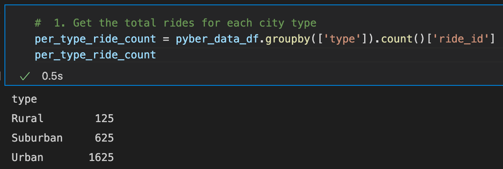

1.2 Total number of drivers for each city type:
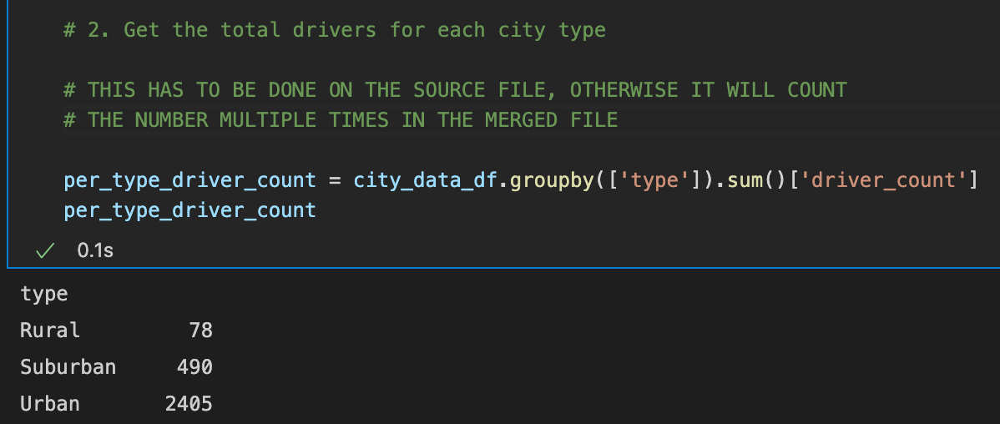

1.3 ​Sum of the fares for each city type:
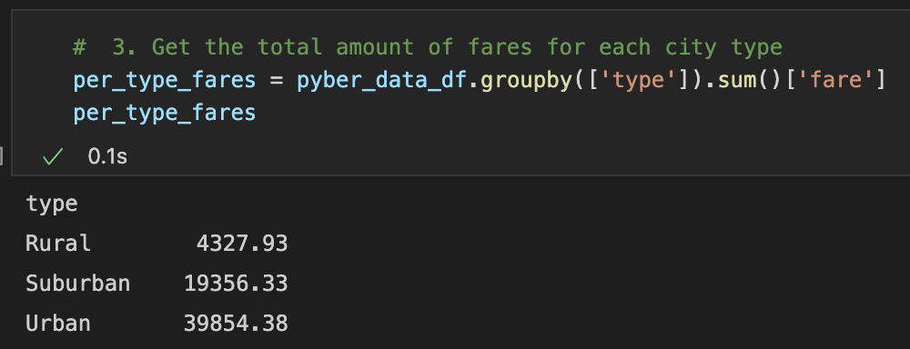

1.4 ​Average fare per ride for each city type:
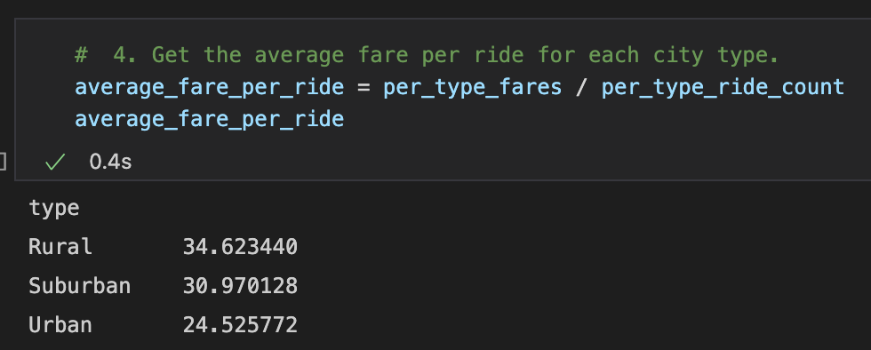

1.5 Average fare per driver for each city type:
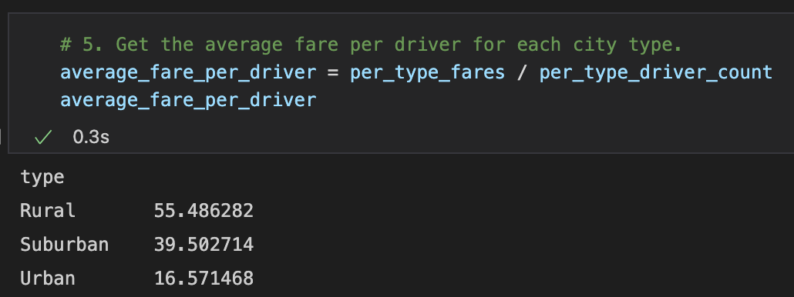

1.6 PyBer summary DataFrame:
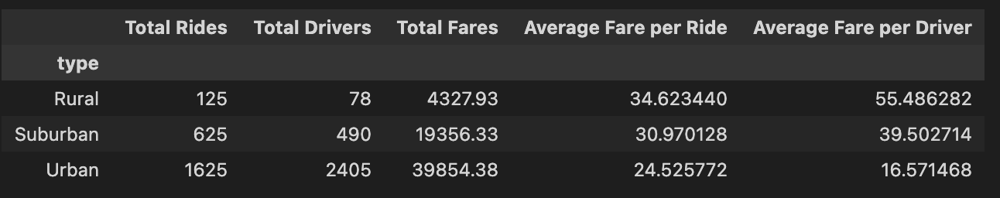

1.7 Formatted PyBer summary:
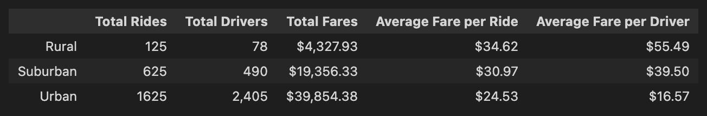

## Deliverable 2

2.1 A DataFrame was created using the groupby() function on the "type" and "date" columns, and the sum() method applied on the "fare" column to show the total fare amount for each date and time.
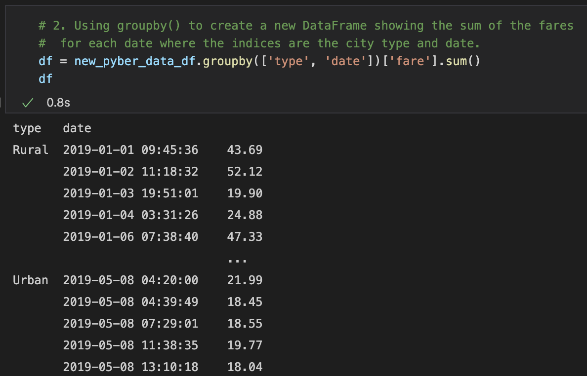

2.2 A DataFrame was created using the pivot() function where the index is the "date," the columns are the city "type," and the values are the "fare".
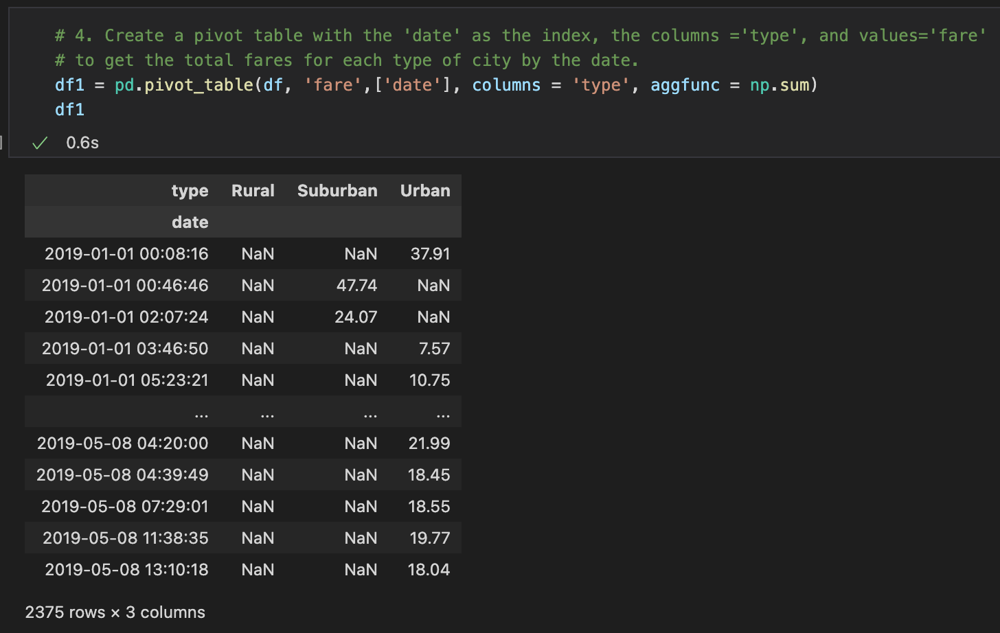

2.3 A DataFrame was created using the loc method on the date range: 2019-01-01 through 2019-04-29.
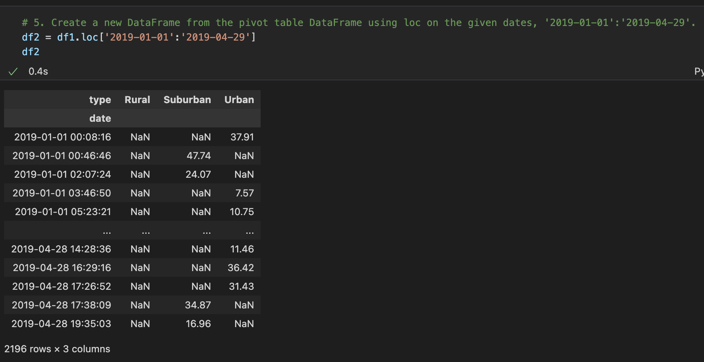

2.4 A DataFrame was created using the resample() function in weekly bins and shows the sum of the fares for each week.
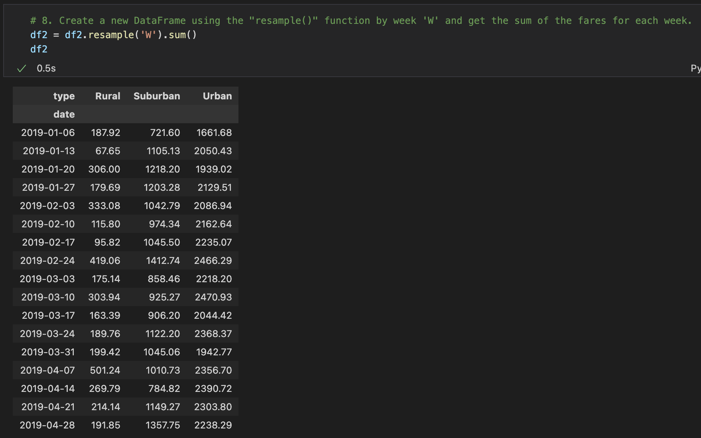

2.5 An annotated chart showing the total fares by city type was created and saved to the "Analysis" folder.
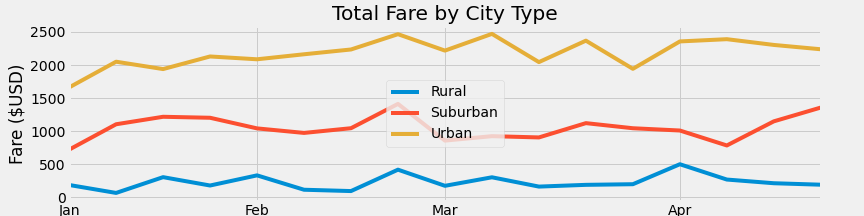

## Deliverable 3

### Analysis

3.1 Analysis Overview

The purpose of this analysis is to compare different metrics of the rides in different city types: urban, suburban and rural.

This will be done by using Python's capabilities, including but not limited to:
- reading csv files
- merging files
- groupby
- formatting
- pivot table
- resample
- plot using the object-oriented method

3.2 Results

* Differences in ride-sharing data among the different city types

	The urban cities have the highest number of rides (1,625), number of drivers (2,405) and total fares collected ($ 39,854.38). Comparing the number of rides, the suburban cities have just 38% of the urban cities, while the rural cities only 8% of the urban cities.

	Similar behavior can be seen when comparing the number of driver: 20% and 3% respectively.

	But absolute values could be deceiving, ratios are valuable indicators when making comparisons.

* Ride-sharing averages

	When comparing the fares per ride, the rural cities top at 34.6 $/ride, while the urban cities are the lowest at 24.5 $/ride. Likely the distances driven in rural areas are bigger or the price per mile is higher.

	A similar trend is observed in the fare per driver category, 55.5 $/driver in rural cities and 16.5 $/driver in urban cities.

3.3 Summary

	After analyzing the data provided, the following findings can be drawn:

* The total fares in urban cities (63% of the total) are consistently the highest among the three types of cities, but this is driven by the huge number of rides and drivers (68% and 81% respectively).
* The average fare per ride is the highest in rural cities (34.62 $/ride), despite having fewer rides (compared to urban and suburban cities).
* The fare per driver is also the highest in rural cities: 3.3 times the amount done in urban cities. The low value in urban cities is caused by the large number of drivers.